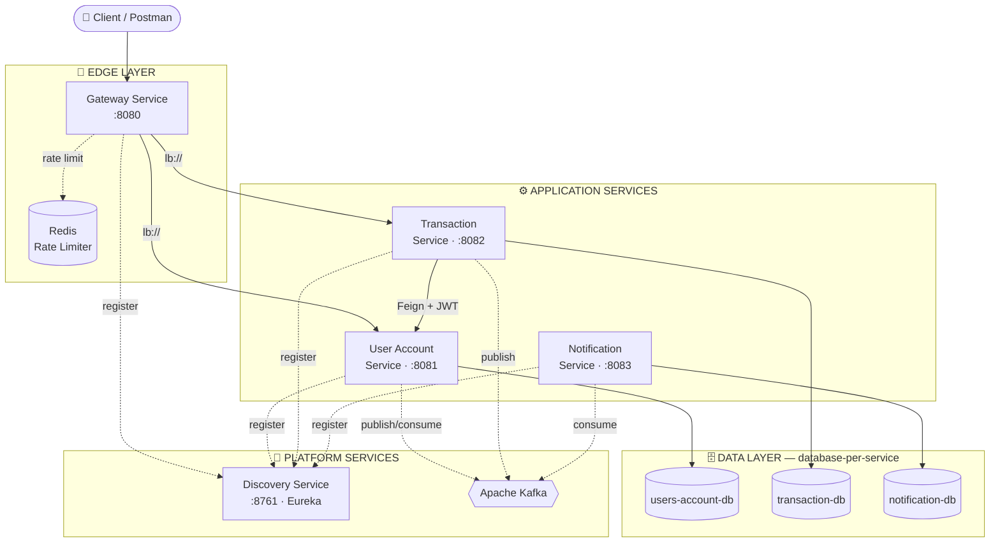

# 🏦 BankApp Microservice

Hệ thống ngân hàng số (digital banking) được xây dựng theo kiến trúc **microservices**, mô phỏng các nghiệp vụ lõi của một ngân hàng: quản lý người dùng, tài khoản, giao dịch chuyển/rút tiền và thông báo email — với các cơ chế production-grade như service discovery, API Gateway, rate limiting, circuit breaker và giao tiếp bất đồng bộ qua Kafka.

> Dự án cá nhân phục vụ mục đích học tập và làm portfolio cho vị trí **Fresher Java Backend Developer**.

<p align="left">
  
  
  
  
  
  
</p>

---

## 📖 Mục lục

- [Tổng quan](#-tổng-quan)
- [Kiến trúc hệ thống](#-kiến-trúc-hệ-thống)
- [Công nghệ sử dụng](#-công-nghệ-sử-dụng)
- [Danh sách services](#-danh-sách-services)
- [Tính năng chính](#-tính-năng-chính)
- [Giao tiếp bất đồng bộ (Kafka)](#-giao-tiếp-bất-đồng-bộ-kafka)
- [Bắt đầu nhanh](#-bắt-đầu-nhanh)
- [Biến môi trường](#-biến-môi-trường)
- [API Documentation](#-api-documentation)
- [Cấu trúc thư mục](#-cấu-trúc-thư-mục)
- [Triển khai (Deployment)](#-triển-khai-deployment)
- [Roadmap](#-roadmap)
- [Tác giả](#-tác-giả)

---

## 🎯 Tổng quan

**BankApp Microservice** là hệ thống backend ngân hàng gồm 5 service độc lập, giao tiếp với nhau qua **Eureka Service Discovery**, được điều phối bởi một **API Gateway** duy nhất, và đồng bộ dữ liệu bất đồng bộ qua **Apache Kafka**. Mỗi service sở hữu database riêng theo mô hình **database-per-service**, đảm bảo tính độc lập và khả năng mở rộng.

Hệ thống hỗ trợ các nghiệp vụ:
- Đăng ký / đăng nhập, xác thực bằng **JWT**
- Quản lý tài khoản ngân hàng (số dư, loại tài khoản, trạng thái)
- Chuyển khoản, rút tiền, nạp tiền (admin), tra cứu lịch sử giao dịch
- Gửi email thông báo tự động khi có biến động số dư
- Các API quản trị (admin) dành cho vận hành hệ thống

## 🏗 Kiến trúc hệ thống



**Cách đọc sơ đồ:** 4 khu vực tách biệt theo vai trò — **Edge Layer** (cổng vào + rate limit), **Application Services** (3 service nghiệp vụ, mỗi ô thẳng hàng với DB tương ứng bên dưới), **Data Layer** (mỗi service một database riêng), và **Platform Services** (Eureka cho service discovery, Kafka cho giao tiếp bất đồng bộ — dùng chung cho toàn hệ thống nên đặt tách riêng thay vì nối chằng chịt vào từng service).

**Luồng xử lý chính:** Client gọi vào **Gateway** → Gateway xác thực JWT, áp rate limit (Redis) và circuit breaker (Resilience4j) → route request tới service tương ứng qua Eureka (load-balanced) → service xử lý nghiệp vụ, lưu DB riêng, và publish sự kiện lên Kafka để các service khác (ví dụ Notification) xử lý bất đồng bộ.

## 🛠 Công nghệ sử dụng

| Nhóm | Công nghệ |
|---|---|
| **Ngôn ngữ / Framework** | Java 21, Spring Boot 3, Spring Cloud 2023.x |
| **Service Discovery** | Netflix Eureka |
| **API Gateway** | Spring Cloud Gateway (WebFlux), Resilience4j (Circuit Breaker), Redis Rate Limiter |
| **Bảo mật** | Spring Security, JWT (JJWT) |
| **Giao tiếp đồng bộ** | OpenFeign (transaction-service → user-account-service) |
| **Giao tiếp bất đồng bộ** | Apache Kafka |
| **Cơ sở dữ liệu** | MySQL 8 (database-per-service), Spring Data JPA |
| **Cache** | Redis |
| **Email** | Spring Mail + Thymeleaf template |
| **API Docs** | springdoc-openapi (Swagger UI) |
| **Đóng gói & triển khai** | Docker, Docker Compose, Kubernetes manifests |
| **Khác** | Lombok, ModelMapper, Bean Validation |

## 🧩 Danh sách services

| Service | Port | Vai trò |
|---|---|---|
| `discovery-service` | 8761 | Eureka Server — đăng ký & khám phá service |
| `gateway-service` | 8080 | API Gateway — routing, JWT validation, rate limiting, circuit breaker |
| `user-account-service` | 8081 | Đăng ký/đăng nhập, quản lý user & tài khoản ngân hàng |
| `transaction-service` | 8082 | Chuyển khoản, rút/nạp tiền, lịch sử giao dịch |
| `notification-service` | 8083 | Lắng nghe sự kiện Kafka, gửi email thông báo |

## ✨ Tính năng chính

### 🧾 Chức năng nghiệp vụ (Functional)

**Xác thực & phân quyền**
- Đăng ký, đăng nhập với JWT (`/api/auth/register`, `/api/auth/login`)
- Phân quyền theo Role (User / Admin) ở tầng service, JWT được Gateway xác thực và Feign lan truyền header `Authorization` giữa các service nội bộ

**Quản lý tài khoản** (`user-account-service`)
- Xem thông tin cá nhân, tài khoản của chính mình (`/api/users/me`, `/api/accounts/me`)
- Tra cứu tài khoản theo số tài khoản
- Admin: tìm kiếm, thống kê, khóa/mở tài khoản người dùng

**Giao dịch** (`transaction-service`)
- Chuyển khoản (`/transfer`), rút tiền (`/withdraw`), admin nạp tiền (`/admin/deposit`)
- Tra cứu lịch sử giao dịch theo chiều (in/out), theo mã tham chiếu giao dịch

**Thông báo** (`notification-service`)
- Lắng nghe sự kiện `user-registered-events`, `balance-update-notification-events`
- Gửi email HTML (Thymeleaf) khi có tài khoản mới hoặc biến động số dư

### ⚙️ Yêu cầu phi chức năng (Non-Functional)

| Thuộc tính | Cách hiện thực trong dự án |
|---|---|
| **Service Discovery** | Eureka Server — service tự đăng ký, Gateway route động qua `lb://`, không hardcode địa chỉ |
| **Khả năng chịu lỗi (Resilience)** | Resilience4j Circuit Breaker + fallback endpoint tại Gateway; retry với backoff khi gọi GET downstream |
| **Bảo mật (Security)** | JWT stateless auth, xác thực tập trung tại Gateway, lan truyền `Authorization` header qua Feign giữa các service nội bộ |
| **Giới hạn tải (Rate Limiting)** | Redis Token Bucket tại Gateway, giới hạn theo từng user (key resolver) |
| **Khả năng mở rộng (Scalability)** | Database-per-service, service stateless → scale ngang độc lập từng service |
| **Tách rời & bất đồng bộ (Decoupling)** | Giao tiếp qua Kafka giữa các service nghiệp vụ, giảm phụ thuộc trực tiếp và tăng khả năng chịu tải đột biến |
| **Khả năng vận hành (Observability/Ops)** | Healthcheck Spring Actuator cho từng service; Docker Compose khởi động tuần tự theo `depends_on: condition: service_healthy` |
| **Khả năng triển khai (Deployability)** | Đóng gói Docker cho từng service, có sẵn manifest Kubernetes để triển khai lên cluster |

## 📨 Giao tiếp bất đồng bộ (Kafka)

| Topic | Producer | Consumer | Mục đích |
|---|---|---|---|
| `user-registered-events` | user-account-service | notification-service | Gửi email chào mừng khi user đăng ký |
| `balance-update-events` | transaction-service | user-account-service | Cập nhật số dư tài khoản sau giao dịch |
| `balance-update-notification-events` | user-account-service | notification-service | Gửi email thông báo biến động số dư |

## 🚀 Bắt đầu nhanh

### Yêu cầu

- Docker & Docker Compose
- JDK 21 (nếu muốn chạy từng service riêng lẻ ngoài Docker)
- Maven (đi kèm sẵn qua `mvnw`)

### Chạy toàn bộ hệ thống bằng Docker Compose

```bash
git clone https://github.com/HungHayHo-IT/banking-microservice.git
cd banking-microservice/docker-compose

# Tạo file .env từ mẫu và điền giá trị thật (xem mục Biến môi trường)
cp .env.example .env

docker compose up -d --build
```

Sau khi các container khởi động và healthy:

| Thành phần | URL |
|---|---|
| Eureka Dashboard | http://localhost:8761 |
| API Gateway | http://localhost:8080 |
| User Account Service (Swagger) | http://localhost:8081/swagger-ui.html |
| Transaction Service (Swagger) | http://localhost:8082/swagger-ui.html |
| Notification Service (Swagger) | http://localhost:8083/swagger-ui.html |

### Dừng hệ thống

```bash
docker compose down          # giữ lại volume dữ liệu
docker compose down -v       # xoá luôn volume (reset toàn bộ dữ liệu)
```

## 🔐 Biến môi trường

> ⚠️ **Quan trọng:** repo hiện đang có giá trị mặc định (fallback) cho `JWT_SECRET` và tài khoản Gmail thật ngay trong `docker-compose.yml`. Trước khi public repo, bạn **nên xoá các giá trị mặc định nhạy cảm này khỏi lịch sử Git** (dùng `git filter-repo` hoặc BFG), đổi mật khẩu ứng dụng Gmail đã lộ, và chỉ truyền secret qua file `.env` không commit. Xem thêm ghi chú cuối phần này.

Tạo file `.env` trong thư mục `docker-compose/` với nội dung:

```env
MYSQL_ROOT_PASSWORD=your_mysql_password
JWT_SECRET=your_long_random_secret_key
MAIL_USERNAME=your_email@gmail.com
MAIL_PASSWORD=your_gmail_app_password
```

| Biến | Mô tả |
|---|---|
| `MYSQL_ROOT_PASSWORD` | Mật khẩu root dùng chung cho 3 instance MySQL |
| `JWT_SECRET` | Khoá bí mật ký JWT, dùng chung giữa `gateway-service`, `user-account-service`, `transaction-service` |
| `MAIL_USERNAME` / `MAIL_PASSWORD` | Tài khoản Gmail + App Password để `notification-service` gửi email |

## 📚 API Documentation

Mỗi service tự expose Swagger UI riêng (springdoc-openapi):

- `user-account-service`: `/swagger-ui.html`
- `transaction-service`: `/swagger-ui.html`
- `notification-service`: `/swagger-ui.html`

**Một số endpoint tiêu biểu** (đi qua Gateway tại `http://localhost:8080`):

```
POST   /api/auth/register
POST   /api/auth/login
GET    /api/users/me
GET    /api/accounts/me
GET    /api/accounts/{accountNumber}
POST   /api/transactions/transfer
POST   /api/transactions/withdraw
GET    /api/transactions/history
GET    /api/transactions/history/direction
GET    /api/transactions/reference/{reference}
```

*(Bạn có thể đính kèm Postman Collection vào repo và link tại đây để review viên test nhanh hơn.)*

## 📁 Cấu trúc thư mục

```
banking-microservice/
├── discovery-service/       # Eureka Server
├── gateway-service/         # API Gateway (routing, JWT, rate limit, circuit breaker)
├── user-account-service/    # User & Account domain
├── transaction-service/     # Transaction domain
├── notification-service/    # Email notification (Kafka consumer)
├── docker-compose/
│   └── docker-compose.yml   # Orchestration cho toàn bộ hệ thống
└── kubernetes/               # Manifest triển khai lên K8s
```

Mỗi service tuân theo cấu trúc package chuẩn theo layer:

```
src/main/java/com/<service_name>/
├── controller/     # REST endpoints
├── service/impl/   # Business logic
├── repository/     # Spring Data JPA
├── entity/         # JPA entities
├── dto/            # Request/Response DTO
├── security/       # JWT filter / SecurityConfig
├── kafka/service/  # Producer / Consumer
├── enums/          # Domain enums
├── exception/      # Global exception handler
└── config/         # Cấu hình bean (ModelMapper, OpenAPI...)
```

## ☸️ Triển khai (Deployment)

Thư mục `kubernetes/` chứa manifest triển khai theo thứ tự:

```bash
kubectl apply -f kubernetes/0_configmaps.yaml
kubectl apply -f kubernetes/1_secret.yml
kubectl apply -f kubernetes/2_mysql.yaml
kubectl apply -f kubernetes/3_redis.yml
kubectl apply -f kubernetes/3b_kafka.yml
kubectl apply -f kubernetes/4_discovery-service.yml
kubectl apply -f kubernetes/5_user-account-service.yml
kubectl apply -f kubernetes/6_transaction-service.yml
kubectl apply -f kubernetes/7_notification-service.yml
kubectl apply -f kubernetes/8_gateway-service.yml
```

## 🗺 Roadmap

- [ ] Quản lý người thụ hưởng (Beneficiary CRUD)
- [ ] Thống kê chi tiêu (Spending statistics)
- [ ] Hạn mức giao dịch (Transaction limits qua Feign)
- [ ] Tích hợp OAuth2 / Keycloak
- [ ] Observability stack: Prometheus, Grafana, Loki, Tempo
- [ ] CI/CD với GitHub Actions

## 👤 Tác giả

**Nguyễn Phước Nhã Hưng**
Sinh viên CNTT, Trường Đại học Khoa học – Đại học Huế | Backend Developer (Java/Spring)

- GitHub: [@HungHayHo-IT](https://github.com/HungHayHo-IT)
